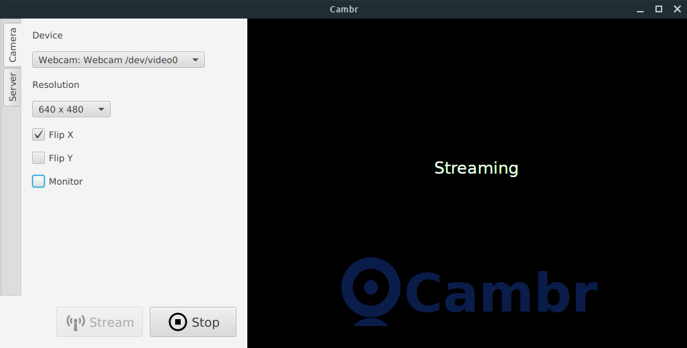

# cambr  

A cross-platform, JavaFX based webcam to MJPEG streamer.



Cambr simply converts your webcams output into an MJEPG stream. 

While it is possible to achieve the same thing with other technologies available on Linux (e.g. GStreamer, VLC), these all involve complicated command line options.

Cambr makes use of [webcam-capture](https://github.com/sarxos/webcam-capture) for device support. 

## Installation

Installers are provided for Linux, Windows and Mac OS. Download and run the GUI installers appropriate for your desktop.

 * [Linux Installer](https://github.com/bithatch/cambr/releases/download/v1.0.0/cambr_unix_1_0_0.sh)  
 * [Mac OS Installer](https://github.com/bithatch/cambr/releases/download/v1.0.0/cambr_macos_1_0_0.dmg)  
 * [Windows Installer](https://github.com/bithatch/cambr/releases/download/v1.0.0/cambr_windows-x64_1_0_0.exe)
 
### Run From Source

To run from source, you will need at least version *3.8.3* of [Apache Maven](https://maven.apache.org/) and a Java 17 development kit. I recommended downloading from [Adoptium](https://adoptium.net/).

Simply run the following from the directory you clone to.

```
mvn javafx:run
```

## Usage

Start the app, select a device and click *Stream*. Then point a browser to http://localhost:8080 and you should see your webcams output.

 * Select the *Server* tab to change the port number, or to make the stream available on non-localhost address.
 * Select the *Camera* tab to flip the camera input in either direction, or to monitor the output.
 
### Advanced

If you wish to make your stream available on the Internet, make sure you turn *Local Only* OFF, and set up a *Port Forward* from your router to your computers LAN address on the configured port. How to do this will vary greatly depending on your router, so consult it's documentation for more information. 
 
 
## Changes

### 1.0.0

 * Initial release

## Development

Find the source and submit pull requests at the GitHub project page, you know the drill.

## License

cambr is made available under [GPL version 3](https://www.gnu.org/licenses/gpl-3.0.en.html). Other components under their respective licenses. 

